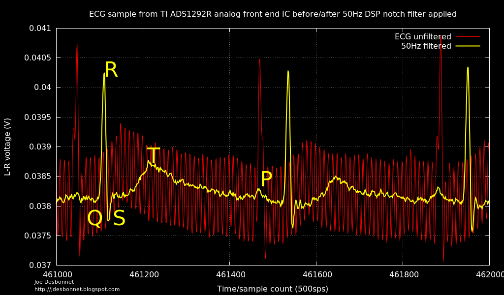

# LPC1114 / ADS1292R ECG firmware

This software is based on the freely available LPC1114 Reference Design available
at www.microBuilder.eu, and is licensed under the BSD license (see license.txt
for details) [1]  It extends that project to add commands for interfacing with 
the ADS1292R ECG analog frond end IC.

The hardware design files are here: 
https://github.com/jdesbonnet/WombatMedical/tree/master/hardware/ecg/prototype1/pcb

## References

The latest version of the software is always available at the following url:

[1] http://www.microbuilder.eu/Projects/LPC1114ReferenceDesign/LPC1114CodeBase.aspx
Online documentation is available at:
http://www.microbuilder.eu/Projects/LPC1114ReferenceDesign/CodeBaseDocumentation.aspx
